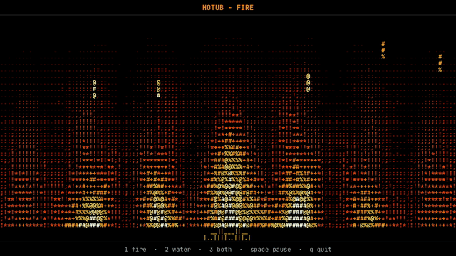
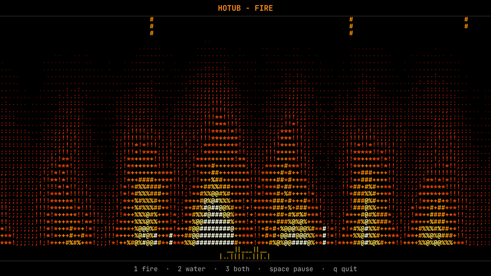
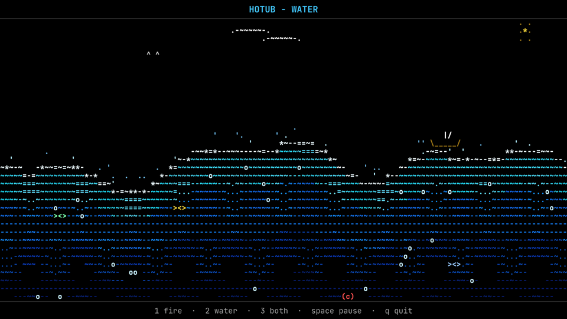
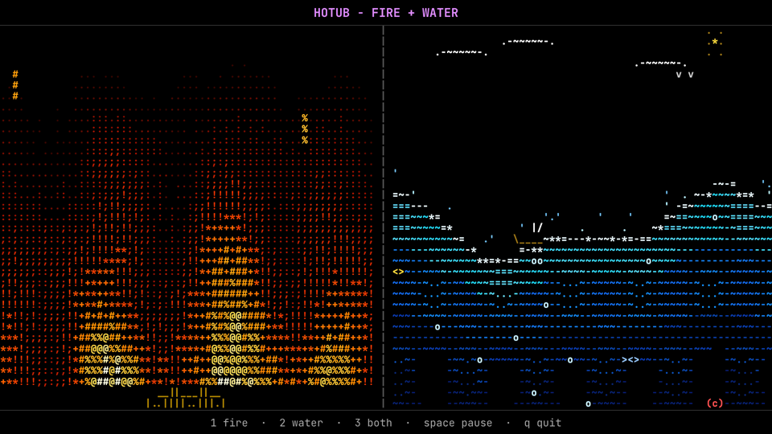

# hotub

Fire + water screensavers for your terminal. Built with iocraft.







## Run

```bash
cargo run
```

## Keys

`1` fire · `2` water · `3` both · `space` pause · `+`/`-` speed · `q` quit
